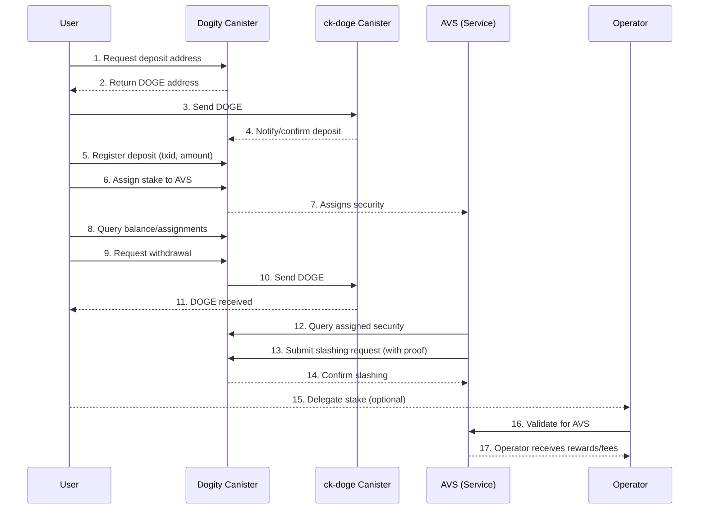

# Dogity: Restaking with Dogecoin on ICP

This project implements a modular restaking protocol inspired by EigenLayer, but using Dogecoin (via ck-doge/Chain Fusion) as the staking token on the Internet Computer (ICP).

## Why Restake with Dogecoin on ICP?

### Benefits of Using Dogecoin for Restaking
- **Large and Liquid Market:** Dogecoin is one of the most widely held and traded cryptocurrencies, with a large, active community and deep liquidity. This makes it an attractive asset for staking and securing new decentralized services.
- **Lower Entry Barriers:** DOGE's low transaction fees and broad accessibility allow a wider range of users to participate in restaking and decentralized security, compared to more expensive or less accessible tokens.
- **Diversified Security:** By enabling restaking with DOGE, new services can tap into a different pool of economic security, reducing reliance on a single asset and increasing the robustness of the ecosystem.

### Contributing to Security and Innovation
- **Bootstrapping New Services:** New protocols and infrastructure projects can leverage the economic weight of the Dogecoin market to bootstrap their own security, without needing to launch a new token or attract traditional stakers.
- **Restaking Model:** Users can assign their DOGE stake to secure multiple services (AVS), earning rewards and contributing to the security of the broader ecosystem, similar to EigenLayer's model on Ethereum.
- **Slashing and Accountability:** Services can define their own slashing conditions, ensuring that stakers are held accountable for misbehavior and that security is enforced in a decentralized, programmable way.

### Leveraging the Internet Computer (ICP)
- **True Cross-Chain Integration:** ICP's Chain Fusion technology allows canisters to natively hold, send, and verify Dogecoin, enabling seamless cross-chain restaking without bridges or custodians.
- **Scalability and Speed:** ICP provides high throughput, low latency, and on-chain programmability, making it ideal for building scalable restaking and security protocols.
- **Composability:** Canisters on ICP can interact with each other and with external blockchains, allowing for rich, composable security and staking applications.

## Platform Flow Diagram



## Overview
- **Users** can deposit Dogecoin (DOGE) into the canister using ck-doge integration.
- **Restaking:** Users can assign their DOGE stake to secure any number of services (AVS: Actively Validated Services).
- **Slashing:** Authorized services can slash (remove) a user's assigned stake if misbehavior is proven.
- **Withdrawals:** Users can withdraw their available DOGE at any time.
- **Modular architecture:** The codebase is split into modules for staking, assignments, slashing, and types for maintainability and extensibility.

## Architecture
- `types.rs`: Shared types and global storage (users, services, assignments).
- `staking.rs`: Deposit, register, and withdraw DOGE using ck-doge.
- `assignments.rs`: Assign stake to services and query assignments.
- `slashing.rs`: Register services and perform slashing on users.
- `lib.rs`: Main entrypoint, re-exports all modules.

## Usage

### 1. Prerequisites
- [DFINITY SDK (dfx)](https://internetcomputer.org/docs/current/developer-docs/setup/install/)
- Rust toolchain
- Access to a deployed [ck-doge canister](https://github.com/ldclabs/ck-doge)

### 2. Environment Variable
Set the principal of the ck-doge canister as an environment variable before deploying or running locally:

```sh
export CK_DOGE_CANISTER_ID=<your_ck_doge_canister_principal>
```

### 3. Deploy
```sh
dfx deploy
```

### 4. Main Flows
- **Deposit DOGE:**
  1. Call `get_deposit_address()` to get your unique Dogecoin deposit address.
  2. Send DOGE to that address.
  3. Call `verify_and_register_deposit(txid, amount)` to register your deposit after confirmation.

- **Assign Stake:**
  - Call `assign_stake(service_id, amount)` to assign part of your balance to a service.

- **Register Service & Slasher:**
  - Call `register_service(service_id, slasher_principal)` to allow a canister to slash for a service.

- **Slashing:**
  - An authorized slasher calls `slash(service_id, user_principal, amount, proof)` to slash a user's assigned stake.

- **Withdraw:**
  - Call `withdraw(doge_address, amount)` to withdraw available DOGE to an external address.

- **Queries:**
  - `get_balance()`, `get_assignments()`, `get_slashed()`

## Extending
- Add delegation, advanced slashing logic, or governance by extending the respective modules.
- Integrate with frontends or other canisters for user experience.

## License
MIT 